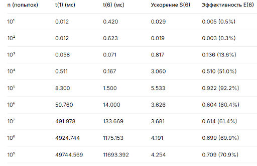
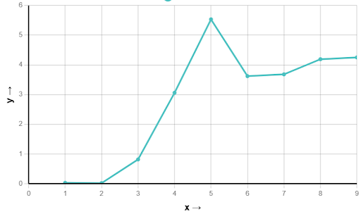

# Зависимость ускорения и эффективности от количества попыток

## График зависимости ускорения от кол-ва попыток

График показывает зависимость ускорения `y = S(p)` от количества попыток `x = log₁₀n`

## Анализ результатов

### 1. Маленькие n (10-1000)
- **Очень низкая эффективность** (< 15%)
- **Причина**: Накладные расходы MPI (создание процессов, коммуникация) значительно превышают время вычислений

### 2. Средние n (10⁴-10⁵)
- **Пик эффективности** при n=10⁵ (92.2%)
- **Идеальное ускорение**: Вычисления доминируют над накладными расходами

### 3. Большие n (10⁶-10⁹)
- **Стабилизация эффективности** на уровне ~60-70%
- **Причина**: Увеличивается объем вычислений, но также растут затраты на редукцию данных

## Выводы

- **Пороговый эффект**: Алгоритм становится эффективным при n > 10⁴
- **Оптимальный диапазон**: n = 10⁴-10⁷ показывает хорошую эффективность
- **Асимптотическое поведение**: При очень больших n эффективность стабилизируется
- **Накладные расходы**: При малых n накладные расходы MPI делают параллелизацию нецелесообразной
