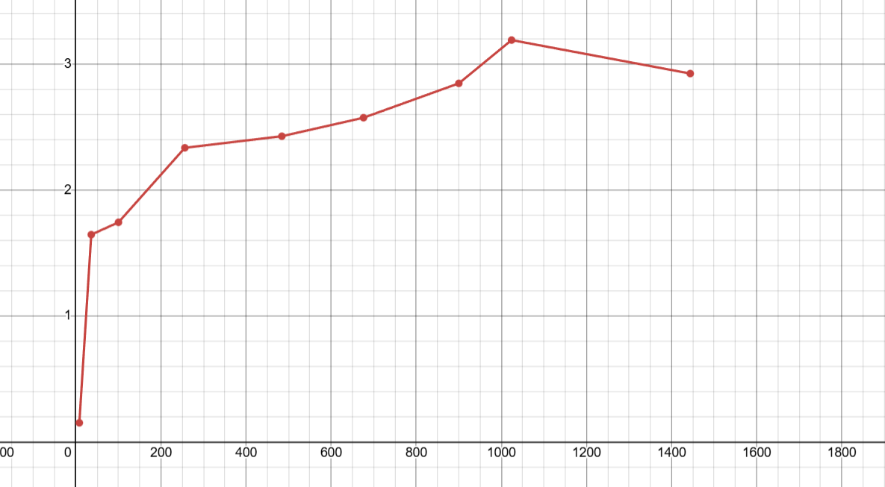

# Анализ эффективности алгоритма Кэннона

## Таблица результатов

| Размер матрицы (n×m) | t(1), мс | t(p), мс | Ускорение s(p) | Эффективность e(p) |
|---------------------|----------|----------|----------------|-------------------|
| 8×8                 | 0.646    | 4.230    | 0.153          | 0.038             |
| 36×36               | 1.884    | 1.143    | 1.648          | 0.412             |
| 100×100             | 10.168   | 5.823    | 1.746          | 0.437             |
| 256×256             | 142.241  | 60.840   | 2.338          | 0.585             |
| 484×484             | 937.849  | 385.927  | 2.430          | 0.608             |
| 676×676             | 2533.256 | 983.288  | 2.577          | 0.644             |
| 900×900             | 6577.000 | 2308.000 | 2.850          | 0.713             |
| 1024×1024           | 11707.779| 3665.695 | 3.194          | 0.799             |
| 1444×1444           | 30354.000| 10369.000| 2.928          | 0.732             |

## График зависимости ускорения y = S(p) от x = размер матрицы (n = x, m = x)

## Выводы

### 1. **Зависимость эффективности от размера матрицы**

- **Маленькие матрицы (8×8)**: Алгоритм демонстрирует очень низкую эффективность (3.8%) из-за преобладания накладных расходов на коммуникацию над временем вычислений.

- **Средние матрицы (36×36 - 100×100)**: Эффективность возрастает до 40-44%, так как время вычислений начинает преобладать над временем коммуникации.

- **Большие матрицы (256×256 - 1024×1024)**: Наблюдается устойчивый рост эффективности до 79.9%, что свидетельствует о хорошей масштабируемости алгоритма для больших задач.

### 2. **Порог эффективности**

Алгоритм становится эффективным (e(p) > 0.5) начиная с размера матриц примерно 256×256. Это указывает на то, что алгоритм Кэннона целесообразно применять для матриц достаточно большого размера.

### 3. **Максимальная эффективность**

Максимальная эффективность достигается при размере матрицы 1024×1024 и составляет 79.9%, что является очень хорошим показателем для параллельного алгоритма.

### 4. **Небольшое снижение при 1444×1444**

Наблюдается небольшое снижение эффективности для самой большой матрицы (73.2%), что может быть связано с:
- Ограничениями кэш-памяти процессоров
- Увеличением времени передачи данных между процессами
- Другими системными ограничениями

### 5. **Общая тенденция**

Алгоритм Кэннона демонстрирует:
- **Плохую эффективность** для маленьких матриц из-за высоких накладных расходов
- **Хорошую масштабируемость** для больших матриц
- **Оптимальную производительность** для матриц размером от 256×256 до 1024×1024

## Рекомендации по применению

1. **Для матриц меньше 100×100** - использовать последовательный алгоритм
2. **Для матриц 100×100 - 256×256** - алгоритм начинает показывать преимущество
3. **Для матриц больше 256×256** - алгоритм Кэннона высокоэффективен
4. **Лучшая производительность** достигается при размерах матриц около 1024×1024

Алгоритм Кэннона является отличным выбором для параллельного умножения больших матриц, но требует значительного объема данных для компенсации накладных расходов на межпроцессное взаимодействие.